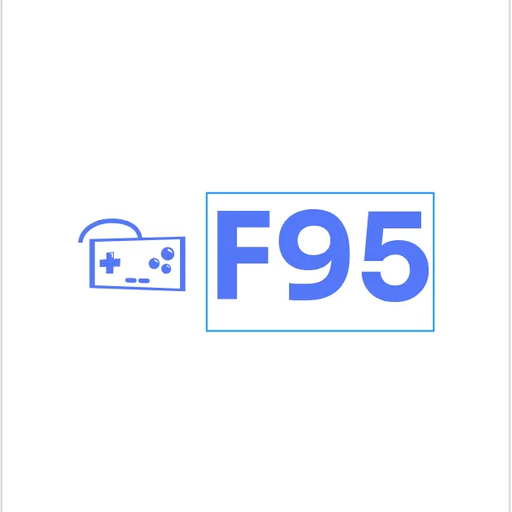

# F95 Game Launcher

<div align="center">



**A modern desktop game launcher with F95Zone integration**

[](https://opensource.org/licenses/MIT)
[](https://electronjs.org/)
[](https://reactjs.org/)
[](https://typescriptlang.org/)

[Download](#download) • [Features](#features) • [Installation](#installation) • [Usage](#usage) • [Development](#development)

</div>

## Overview

F95 Game Launcher is a modern, cross-platform desktop application that helps you organize, manage, and launch your game collection. With optional F95Zone integration, you can discover new games, sync metadata, and keep track of updates.

## Features

### 🎮 **Game Management**
- **Local Library**: Organize your entire game collection in one place
- **Game Launching**: Launch games directly from the launcher
- **Favorites System**: Mark and filter your favorite games
- **Play Time Tracking**: Track time spent in each game
- **Folder Management**: Organize games and open game directories

### 🌐 **F95Zone Integration**
- **Game Discovery**: Search and browse F95Zone's extensive catalog
- **Metadata Sync**: Auto-fetch ratings, tags, developer info, and descriptions
- **Update Notifications**: Get notified when your games have new versions
- **Manual Linking**: Associate F95Zone threads with your local games
- **Direct Links**: Quick access to F95Zone discussion threads

### 🖥️ **User Experience**
- **Offline Mode**: Full local library access without F95Zone login
- **Modern UI**: Clean, dark theme with responsive design
- **Cross-Platform**: Identical experience on Linux and Windows
- **Fast Performance**: Built with Electron and React for optimal speed
- **Privacy Focused**: All data stored locally, no telemetry

### 🔒 **Security & Privacy**
- **Local Storage**: All data stored on your device using electron-store
- **No Telemetry**: Zero data collection or analytics
- **Secure Authentication**: F95Zone credentials handled securely
- **Optional Login**: Full offline functionality available

## Download

### Linux

| Package Type | Description | Download |
|--------------|-------------|----------|
| **Debian (.deb)** | For Ubuntu, Debian, and derivatives | [f95-game-launcher_1.0.0_amd64.deb](LinuxRelease/f95-game-launcher_1.0.0_amd64.deb) |
| **AppImage** | Universal Linux portable | [F95GameLauncher-1.0.0.AppImage](LinuxRelease/F95GameLauncher-1.0.0.AppImage) |

### Windows

| Package Type | Description | Download |
|--------------|-------------|----------|
| **Installer (.exe)** | Full Windows installation | [F95GameLauncher Setup 1.0.0.exe](WindowsRelease/F95GameLauncher%20Setup%201.0.0.exe) |
| **Portable (.exe)** | No installation required | [F95GameLauncher 1.0.0.exe](WindowsRelease/F95GameLauncher%201.0.0.exe) |

### System Requirements

- **Linux**: Ubuntu 18.04+ / Debian 10+ (x64)
- **Windows**: Windows 10+ (x64)
- **RAM**: 512MB minimum, 1GB recommended
- **Storage**: 200MB installation space

## Installation

### Linux (Debian/Ubuntu)
```bash
# Download and install the .deb package
sudo dpkg -i f95-game-launcher_1.0.0_amd64.deb

# Launch from terminal
F95

# Or launch from applications menu
```

### Linux (AppImage)
```bash
# Make executable and run
chmod +x F95GameLauncher-1.0.0.AppImage
./F95GameLauncher-1.0.0.AppImage
```

### Windows
1. Download `F95GameLauncher Setup 1.0.0.exe`
2. Run the installer and follow the setup wizard
3. Launch from Start Menu or Desktop shortcut

For detailed installation instructions, see:
- [Linux Installation Guide](LinuxRelease/README.md)
- [Windows Installation Guide](WindowsRelease/README.md)

## Usage

### Quick Start
1. **Launch the application**
2. **Sign in to F95Zone** (optional - enables syncing features)
   - Or use **Offline Mode** for local games only
3. **Add games to your library**
   - Browse local games or search F95Zone
4. **Organize and launch** your games

### Key Features

#### Adding Games
- **From F95Zone**: Search and add games directly from F95Zone
- **Local Games**: Add games already installed on your system
- **Manual Linking**: Associate F95Zone threads with local games

#### Library Management
- **Play Games**: Launch games directly from the launcher
- **Organize**: Mark favorites, track play time
- **Update Tracking**: Get notified of new game versions
- **Folder Access**: Quick access to game directories

#### Offline Mode
- Access your local game library without F95Zone login
- Perfect for privacy or offline gaming
- All local features remain available

## Development

### Prerequisites
- Node.js 18+ and npm
- Git

### Setup
```bash
# Clone the repository
git clone https://github.com/PersonThing4982/F95-Launcher.git
cd F95-Launcher

# Install dependencies
npm install

# Start development server
npm run dev
```

### Build Commands
```bash
# Build for development
npm run build

# Build Linux packages
npm run dist:linux

# Build Windows packages
npm run dist:win

# Build all platforms
npm run dist:all
```

### Tech Stack
- **Framework**: Electron 28
- **Frontend**: React 18 + TypeScript
- **Styling**: Tailwind CSS
- **API**: F95API (@millenniumearl/f95api)
- **Storage**: electron-store
- **Logging**: Winston
- **Build**: Vite + electron-builder

## Contributing

1. Fork the repository
2. Create a feature branch (`git checkout -b feature/amazing-feature`)
3. Commit your changes (`git commit -m 'Add amazing feature'`)
4. Push to the branch (`git push origin feature/amazing-feature`)
5. Open a Pull Request

## License

This project is licensed under the MIT License - see the [LICENSE](LICENSE) file for details.

## Disclaimer

This application is not affiliated with or endorsed by F95Zone. It's an independent tool that uses F95Zone's public API for game metadata and discovery. Please respect F95Zone's terms of service when using this application.

## Support

- 🐛 **Bug Reports**: [GitHub Issues](https://github.com/PersonThing4982/F95-Launcher/issues)
- 💡 **Feature Requests**: [GitHub Issues](https://github.com/PersonThing4982/F95-Launcher/issues)
- 📖 **Documentation**: [Wiki](https://github.com/PersonThing4982/F95-Launcher/wiki)

---

<div align="center">

Made with ❤️ by the F95 Launcher community

[⭐ Star this project](https://github.com/PersonThing4982/F95-Launcher) if you find it useful!

</div>